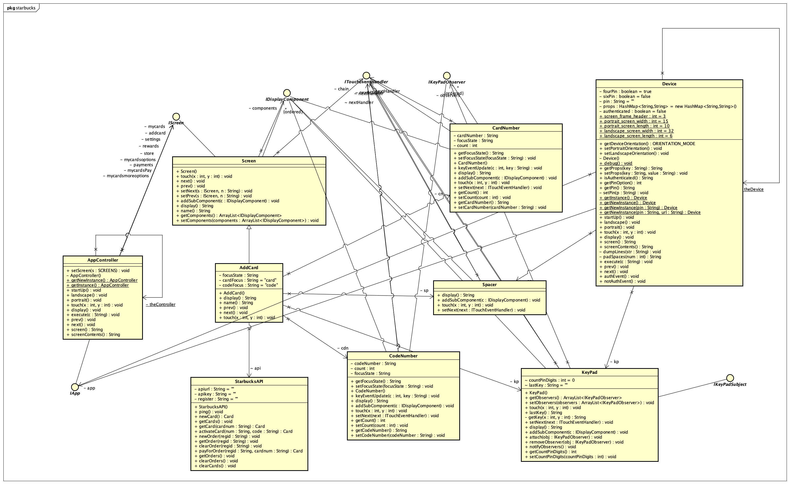

# Starbucks Mobile App (Text UI) Project

# Add Card Sequence Diagram

Adding a new card flow entails  
->going to Settings menu and giving a touch(1,1) and selecting Add Card menu option 
->The Add card screen gets displayed which has sub components such as Keypad,Card Number,Code Number,Spacer.Here composite pattern is being used. 
->Giving a touch(1,2) shifts focus to card number so that user can enter Card Id of Card.When focus is on card number user enters his card Id by giving simultaneous touches.Here both Observer pattern and Chain of responsibility is being utilised. 
->When a user gives touch(2,3) focus shifts to Card Code where he can enter Card Code of his card. 
->When a user enters a valid card, and API call is made to activate the card and once it activates that Card number along with its balance is being displayed on My Cards Pay screen. 
->Card number which has less that 9 digits or Card number with nine zeros or card code with less than 3 digits are invalid Card inputs and as soon as user types next, app makes the users stay in the Add Card screen and clears the previously entered user inputs. 
->If a user entered a valid card and types next he will be redirected to My Cards Main screen which displays newly added Card's balance.  

 
# Class Diagram for Adding a New Card

 
# Class Diagram for 4-Pin vs 6-Pin Authentication

A user can login to the App with No pin or 4 Pin or 6 Pin digits. 
Here Pin Entry Machine is being utilised to track the state of the entered Pins.This explains the State Pattern. 
When user provides input of the Pins,the Pin count and the entered pin gets obsereved.Here the observers get notified of the user input which in this case is Keypad.This explains the Observer pattern. 
When user provides a series of inputs it gets handled by the next object in chain.Here the responsibilty is getting passed in a chain which explains the Chain of responsibilty pattern.  

 
# Class Diagram for Screen Layout Management (i.e. Centerring + Supports Landscape)

The Starbucks application supports both Potrait and Landscape modes. 
Landscape support is available only for the My Cards Main and My Cards Pay screen.Rest all screens can support only Potrait mode. 
Handling different modes for selected set of screens is achieved by Strategy Pattern. 
The screen contents for some sreens are Center Justified and for some are left justified.This can be achieved using decorator pattern.  

